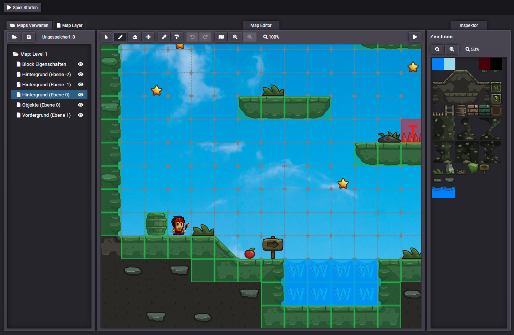
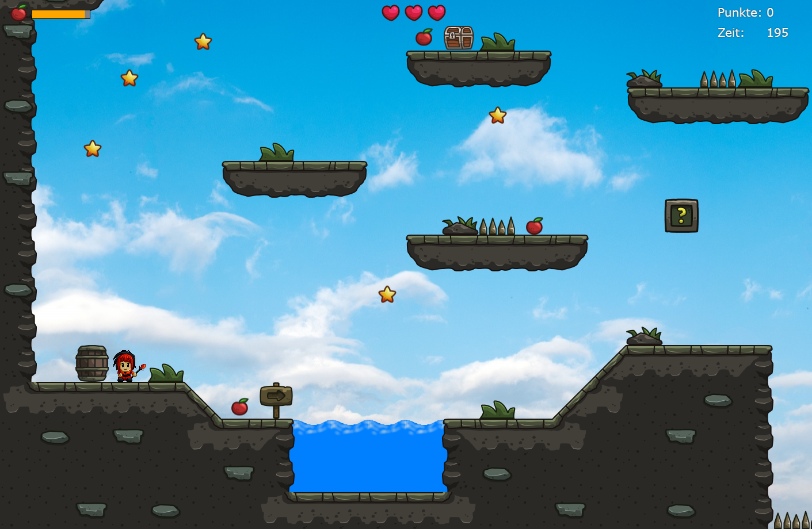

# Spiel Editor

Der **Spiel Editor** ermöglicht Ihnen die Erstellung von Spielkarten (Maps) für Ihr Spielprojekt.



## Spiel
Sie können das erstellte Spiel direkt aus dem Editor starten, indem Sie auf die Schaltfläche "Play" klicken. Darüber hinaus können Sie den generierten Link teilen, sodass andere Benutzer Ihr Spiel spielen können.



## Systemanforderungen 🔧
Für die Verwendung des Editors und die Erstellung neuer Maps sind folgende Systemanforderungen erforderlich:
- Der Webserver muss PHP unterstützen, um neue Maps zu erstellen.
- Der Ordner "Maps" benötigt Schreibrechte auf dem Server.
- Vorhandene Maps können auf einem einfachen Webserver ausgeführt werden, der HTML und JS unterstützt.

## Installation 🔌
Folgen Sie diesen Schritten, um den Spiel Editor auf Ihrem eigenen Server zu installieren:

1. Laden Sie die Repository-Daten herunter, indem Sie den folgenden Befehl ausführen:
   ```shell
   git clone https://github.com/mikework24/editor.git
   ```

2. Übertragen Sie die heruntergeladenen Daten auf Ihren Webserver.

3. Rufen Sie die zugehörige URL auf, um den Editor zu starten.

## Demo
Probieren Sie die Demo des Spiel Editors aus:
- [Editor Demo](https://editor.mike-work.com/)
- [Spiel Demo](https://editor.mike-work.com/game.html?id=VeptKXeGA)

## Rechte - Genutzter Code und Grafiken
- Editor (nur Style): [CodePen](https://codepen.io/zerratar/pen/aLKqBV)
- The Game Engine: [CodePen](https://codepen.io/dissimulate/pen/AGYEby)
- Grafiken: 
  - [Kostenloses Cartoon 2D Tileset](https://craftpix.net/freebies/free-medieval-ruins-cartoon-2d-tileset/?num=9&count=158&sq=free%202d%20tileset&pos=1)
  - [Kostenlose Pixel Art Game Heroes](https://craftpix.net/freebies/assassin-mage-viking-free-pixel-art-game-heroes/)